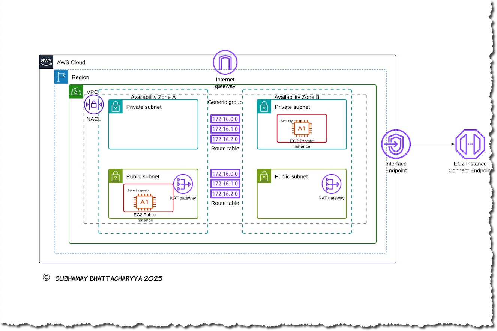

         


# AWS Networking Immersion Day - Lab 01: VPC Fundamentals

[](https://aws.amazon.com/)
Brief description of the project. Explain what it does and its primary purpose.

---

## Table of Contents

- [About the Project](#about-the-project)
    - [The problem it solves](#the-problem-it-solves)
    - [Why It's useful](#why-its-useful)
    - [Key AWS services used](#key-aws-services-used)
- [Architecture](#architecture)
- [Getting Started](#getting-started)
  - [Prerequisites](#prerequisites)
  - [Installation](#installation)
- [Deployment](#deployment)
- [Configuration](#configuration)
- [Contributing](#contributing)
- [License](#license)
    - [Code of Conduct](#code-of-conduct)
- [Contact](#contact)

---

## About the Project

This project provides a comprehensive CloudFormation template for setting up a Virtual Private Cloud (VPC) with various networking components. It is designed to facilitate AWS Networking Immersion Day, Lab 01: VPC Fundamentals.

##### The problem it solves
Setting up a VPC with all necessary components can be complex and time-consuming. This project simplifies the process by providing a ready-to-use CloudFormation template that automates the creation of a VPC, subnets, route tables, internet gateways, NAT gateways, security groups, and EC2 instances.

##### Why it’s useful
- **Automation**: Automates the creation of networking components, reducing manual effort and the potential for errors.
- **Scalability**: Provides a scalable architecture that can be easily modified to fit different environments (development, testing, production).
- **Best Practices**: Implements AWS best practices for networking and security.

##### Key AWS services used
- **Amazon VPC**: To create a logically isolated network.
- **Amazon EC2**: To launch virtual servers within the VPC.
- **AWS CloudFormation**: To automate the deployment of AWS resources.


---

## Architecture

The reference architecture diagram.



The provided AWS architecture diagram illustrates a Virtual Private Cloud (VPC) setup with the following components:

1. **VPC Structure**:
   - A single VPC spans across two Availability Zones (Zone A and Zone B).
   - Each zone contains one public subnet and one private subnet.

2. **Routing and Security**:
   - Public subnets are connected to the Internet Gateway (IGW) for external communication.
   - NAT Gateways in public subnets enable private subnet instances to access the internet securely.
   - Separate route tables manage traffic in public and private subnets.
   - Network ACLs and Security Groups provide layered security.

3. **EC2 Instances**:
   - Public subnets host EC2 instances with direct internet access.
   - Private subnets host EC2 instances with restricted access, relying on NAT Gateways for outbound traffic.

4. **Endpoints**:
   - An Interface Endpoint facilitates private communication with AWS services.
   - An EC2 Instance Connect Endpoint is included for secure SSH/RDP connectivity to private instances.

This architecture demonstrates a foundational, secure, and scalable AWS network design suitable for hosting cloud applications.

## Getting Started

To get a local copy up and running follow these simple steps.

##### Prerequisites

Make sure you have the following installed:
- AWS CLI
- AWS CloudFormation
- An AWS account with appropriate permissions
- Clone the repo
    ```sh
   git clone https://github.com/subhamay-bhattacharyya/aws-cfn-nested-stacks.git
   ```
- Upload the nested stack templates to a bucket in your AWS account
    ```
    cd <your local directory>aws-cfn-nested-stacks
    aws s3 sync /cfn-templates/ s3://<your bucket> --sse "aws:kms" \
          --sse-kms-key-id <your kms key id> --storage-class GLACIER_IR
    ```

##### Installation

1. Clone the repo
   ```sh
   git clone https://github.com/subhamay-bhattacharyya/0101-networking-cft.git
   ```

## Deployment

To deploy this project, follow these steps:

1. **Configure AWS CLI**: Ensure your AWS CLI is configured with the necessary credentials and region.
   ```sh
   aws configure
   ```

2. Validate the CloudFormation template: Before deploying, validate the CloudFormation template to ensure there are no errors.

```
aws cloudformation validate-template --template-body file://template.yaml
```
3. Deploy the CloudFormation stack: Use the AWS CLI to deploy the stack.

```
aws cloudformation deploy --template-file template.yaml --stack-name my-vpc-stack --capabilities CAPABILITY_NAMED_IAM
```

4. Monitor the deployment: You can monitor the progress of the stack deployment in the AWS CloudFormation console.

5. Verify resources: Once the stack is deployed, verify that all resources have been created successfully by checking the AWS Management Console.

## Contributing

Contributions are what make the open-source community such an amazing place to learn, inspire, and create. Any contributions you make are **greatly appreciated**.

If you have a suggestion that would make this project better, please fork the repo and create a pull request. You can also simply open an issue with the tag "enhancement".
Don't forget to give the project a star! Thanks again!

1. Fork the Project
2. Create your Feature Branch (`git checkout -b feature/AmazingFeature`)
3. Commit your Changes (`git commit -m 'Add some AmazingFeature'`)
4. Push to the Branch (`git push origin feature/AmazingFeature`)
5. Open a Pull Request

##### Code of Conduct

Please note that this project is released with a [Contributor Code of Conduct](CODE_OF_CONDUCT.md). By participating in this project you agree to abide by its terms.

## License

Distributed under the MIT License. See `LICENSE` for more information.

## Contact

Subhamay Bhattacharyya
[ LinkedIn](https://www.linkedin.com/in/subhamay-bhattacharyya/)
[ GitHub](https://github.com/subhamay-bhattacharyya)
[](mailto:subhamay.aws@gmail.com)
Project Link: [https://github.com/subhamay-bhattacharyya/0101-networking-cft](https://github.com/subhamay-bhattacharyya/0101-networking-cft)